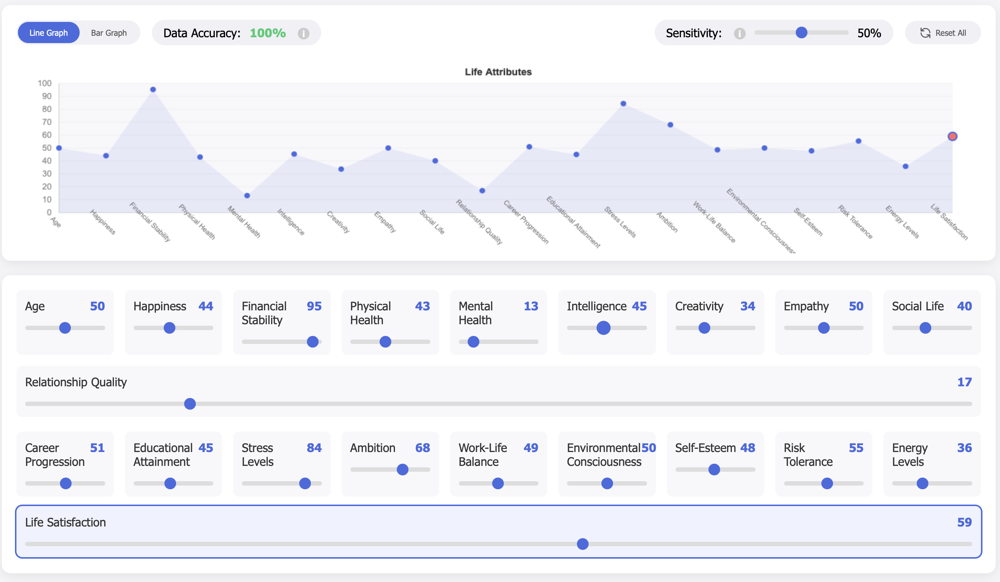

## 🎮 Demo

<details># 🧩 IdentitySim

<div align="center">

# [🔴 LIVE DEMO](https://drip7789.github.io/IdentitySim/)

[](https://drip7789.github.io/IdentitySim/)


[](https://opensource.org/licenses/MIT)

<br>



**An interactive simulation exploring how 20 life attributes interconnect and affect each other**

[Report Bug](https://github.com/drip7789/IdentitySim/issues) • [Request Feature](https://github.com/drip7789/IdentitySim/issues)

</div>

## 📑 Table of Contents

- [Overview](#-overview)
- [Features](#-features)
- [Demo](#-demo)
- [Technical Implementation](#%EF%B8%8F-technical-implementation)
  - [Interdependency System](#interdependency-system)
  - [Data Accuracy System](#data-accuracy-system)
- [Usage Guide](#-usage-guide)
- [Installation](#-installation)
- [Roadmap](#-roadmap)
- [Contributing](#-contributing)
- [License](#-license)
- [Acknowledgments](#-acknowledgments)

## 🔍 Overview

IdentitySim demonstrates how our lives exist as interconnected systems - happiness affects health, career affects stress levels, ambition affects work-life balance. By modeling 20 key life attributes and their relationships, this tool creates a dynamic ecosystem where changes to one attribute ripple throughout your entire profile.

Try finding a sustainable balance, or challenge the system by creating impossible life scenarios!

## ✨ Features

<table>
  <tr>
    <td width="50%">
      <h3>🎚️ 20 Interactive Sliders</h3>
      <p>Age, Happiness, Financial Stability, Physical Health, Mental Health, Intelligence, Creativity, Empathy, Social Life, Relationship Quality, Career Progression, Educational Attainment, Stress Levels, Ambition, Work-Life Balance, Environmental Consciousness, Self-Esteem, Risk Tolerance, Energy Levels, Life Satisfaction</p>
    </td>
    <td width="50%">
      <h3>🔄 Smart Interdependency System</h3>
      <p>Realistic relationships between attributes with algorithm-driven cascade effects. Changes in one area affect related attributes based on real-world connections.</p>
    </td>
  </tr>
  <tr>
    <td width="50%">
      <h3>⚖️ Overflow Redistribution</h3>
      <p>When an attribute reaches its limit (0 or 100), excess impacts are intelligently redistributed to related attributes instead of being lost.</p>
    </td>
    <td width="50%">
      <h3>🔍 Data Accuracy Monitor</h3>
      <p>Detects contradictory or unrealistic combinations (like high stress with high happiness) and calculates a realism score with visual indicators.</p>
    </td>
  </tr>
  <tr>
    <td width="50%">
      <h3>📊 Dynamic Visualization</h3>
      <p>Toggle between line and bar graphs for different ways to visualize your current life profile with real-time updates.</p>
    </td>
    <td width="50%">
      <h3>🔢 Sensitivity Control</h3>
      <p>Adjust how strongly attributes affect each other using a global multiplier that scales all relationships.</p>
    </td>
  </tr>
  <tr>
    <td width="50%">
      <h3>📝 Change Logs</h3>
      <p>Track all changes with intuitive up/down indicators showing which values increased or decreased in response.</p>
    </td>
    <td width="50%">
      <h3>ℹ️ Smart Tooltips</h3>
      <p>Context-sensitive help tooltips that adapt their position to stay on-screen regardless of where they appear.</p>
    </td>
  </tr>
</table>

## 🎮 Demo

<details>
<summary>Click to see screenshots</summary>
<br>

*Screenshots coming soon*

</details>

## 🛠️ Technical Implementation

IdentitySim is built as a completely self-contained application:

- **Single-File Architecture**: The entire application (HTML/CSS/JS) resides in one file
- **Vanilla JavaScript**: No external dependencies or frameworks - just pure JavaScript
- **Canvas Rendering**: Real-time graph visualization using the HTML5 Canvas API
- **Responsive Design**: Adapts to different screen sizes
- **Browserless Execution**: No server required - runs entirely in the browser

### Interdependency System

The core of IdentitySim is a weighted relationship matrix between attributes. For example:

```javascript
'happiness': {
    'mental': 0.5,      // Increasing happiness boosts mental health
    'selfEsteem': 0.4,  // Increasing happiness improves self-esteem
    'energy': 0.3,      // Increasing happiness raises energy levels
    'stress': -0.4,     // Increasing happiness lowers stress
    'lifeSatisfaction': 0.6,  // Strong positive effect on life satisfaction
    'physical': 0.2     // Mild positive effect on physical health
}
```

### Data Accuracy System

The simulation includes 12 distinct contradiction rules that evaluate how realistic your life profile is:

<details>
<summary>View all contradiction rules</summary>

- **High Happiness with High Stress**
  - Triggers when: Happiness > 70 and Stress > 70

- **High Physical Health with Low Energy**
  - Triggers when: Physical Health > 80 and Energy < 30

- **High Career with Poor Work-Life Balance**
  - Triggers when: Career > 80 and Work-Life Balance < 30

- **High Financial Stability with Low Career**
  - Triggers when: Financial Stability > 80 and Career < 30

- **High Stress with High Mental Health**
  - Triggers when: Stress > 80 and Mental Health > 80

- **High Life Satisfaction with Low Self-Esteem**
  - Triggers when: Life Satisfaction > 80 and Self-Esteem < 30

- **High Intelligence with Low Education**
  - Triggers when: Intelligence > 80 and Education < 30

- **High Ambition with Low Career**
  - Triggers when: Ambition > 80 and Career < 30

- **High Social Life with Very Low Energy**
  - Triggers when: Social Life > 80 and Energy < 20

- **High Creativity with Low Mental Health**
  - Triggers when: Creativity > 80 and Mental Health < 30

- **Advanced Age with Excellent Physical Health**
  - Triggers when: Age > 80 and Physical Health > 80

- **Low Stress with Low Ambition and High Career**
  - Triggers when: Stress < 20 and Ambition < 20 and Career > 80
</details>

## 📖 Usage Guide

<div align="center">

</div>

1. **Adjust Sliders**: Move any slider to see how it affects related attributes
2. **Toggle Graph**: Switch between line and bar visualization with the buttons
3. **Change Sensitivity**: Control interdependency strength with the sensitivity slider
4. **Monitor Accuracy**: Check the data accuracy percentage to see how realistic your combination is
5. **View Logs**: See which attributes changed with each adjustment
6. **Reset System**: Return all values to their default state (50%)

## 💻 Installation

```bash
# Clone the repository
git clone https://github.com/drip7789/IdentitySim.git

# Navigate to the directory
cd IdentitySim

# Open in your browser (no server needed)
open index.html  # on macOS
start index.html  # on Windows
xdg-open index.html  # on Linux
```

Alternatively, simply visit [https://drip7789.github.io/IdentitySim/](https://drip7789.github.io/IdentitySim/) to use the online version.

## 🔮 Roadmap

- [ ] Save/load different life profiles
- [ ] Export visualization as PNG/SVG
- [ ] Add more attributes and interdependencies
- [ ] Create profile templates (e.g., "workaholic", "balanced life")
- [ ] Implement time-based progression simulation

See the [open issues](https://github.com/drip7789/IdentitySim/issues) for a list of proposed features and known issues.

## 🤝 Contributing

Contributions make the open-source community an amazing place to learn, inspire, and create. Any contributions are **greatly appreciated**.

1. Fork the Project
2. Create your Feature Branch (`git checkout -b feature/AmazingFeature`)
3. Commit your Changes (`git commit -m 'Add some AmazingFeature'`)
4. Push to the Branch (`git push origin feature/AmazingFeature`)
5. Open a Pull Request

## 📄 License

Distributed under the MIT License. See `LICENSE` for more information.

## 🙏 Acknowledgments

* Inspired by the complex systems and feedback loops that govern our lives
* Built with a passion for systems thinking and interactive visualization

---

<div align="center">
Made with ❤️ by <a href="https://github.com/drip7789">drip7789</a>
</div>
